# VS Code - Foundry Toolkit ハンズオン

最終更新: 2026-09-04

このハンズオンでは、GitHub Codespaces 上の Visual Studio Code と Foundry Toolkit for VS Code を使い、荷物の配送状況を照会する Microsoft Foundry Hosted Agent を作成します。GitHub Copilot に Microsoft Agent Framework ベースのコードを生成させ、Foundry に登録した MCP ツールを呼び出して、ローカルとクラウドの両方で動作を確認します。

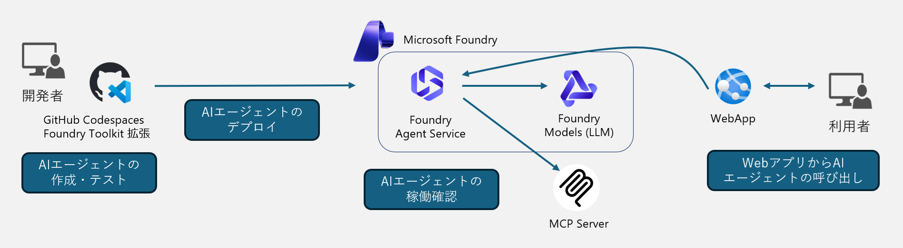

> [!NOTE]
> Microsoft Foundry、Foundry Toolkit、GitHub Copilot の画面や選択肢は更新されることがあります。表記が画像と少し異なる場合は、同じ意味の最新の項目を選択してください。

> [!NOTE]
> 本書は 2026-09-03 時点の画面と、画像に記録された `gpt-5.6-luna`、Python 3.14 の構成を基準にしています。モデル、ランタイム、拡張機能の提供状況が異なる場合は、講師の指定と生成された `azure.yaml` を優先してください。

## 1. このハンズオンで作成するもの

このハンズオンの完了時には、次の構成ができあがります。

1. Microsoft Foundry プロジェクト
2. `gpt-5.6-luna` のモデル デプロイ
3. 配送情報を取得するリモート MCP 接続 `shipment-mcp`
4. MCP 接続を含む Toolbox `delivery-management-toolbox`
5. Python で実装された Hosted Agent `delivery-management-agent`
6. VS Code Agent Inspector を使ったローカル デバッグ環境
7. Microsoft Foundry 上で実行できる Hosted Agent

ハンズオンで使用する主な名前は次のとおりです。

| 項目 | 値 |
|---|---|
| GitHub リポジトリ | `<your-name>-shipping-agent` |
| Foundry プロジェクト | `<your-name>-project` |
| モデル / デプロイ名 | `gpt-5.6-luna` |
| MCP 接続 | `shipment-mcp` |
| Toolbox | `delivery-management-toolbox` |
| Hosted Agent | `delivery-management-agent` |
| テスト用荷物番号 | `QS-00000001` ～ `QS-00000003` |

`<your-name>` は、ほかの参加者と重複しない英数字の名前に置き換えてください。

## 2. 前提条件

開始前に、次の条件を満たしていることを確認してください。

- GitHub アカウントを利用できること
- GitHub Codespaces を作成できること
- GitHub Copilot を利用できること
- Azure サブスクリプションを利用できること
- 指定されたサブスクリプションまたはリソース グループで Foundry プロジェクト、モデル、Toolbox、Hosted Agent を作成できる権限があること
- 講師から配送情報 MCP サーバーのエンドポイントと Function Key が提供されていること
- ブラウザーで GitHub、Azure、Microsoft Foundry のサインイン画面を開けること

> [!CAUTION]
> モデルの呼び出しにはモデルの利用量に応じた料金が、Hosted Agent にはアクティブなセッションが使用する CPU とメモリに応じた料金が発生する場合があります。料金は契約とリージョンにより異なるため、開始前に講師の案内と公式料金ページを確認してください。ハンズオン終了後は「13. 後片付け」に従い、不要なリソースを削除してください。

> [!IMPORTANT]
> MCP の Function Key は秘密情報です。GitHub Copilot のチャット、ソース コード、`.env`、README、Git のコミットには記載しないでください。この手順では Foundry の接続資格情報として登録します。

## 3. GitHub リポジトリと Codespaces の準備

### 3.1 GitHub リポジトリを作成する

1. GitHub にサインインし、自分のプロフィールから `Repositories` を開きます。
2. `New` を選択します。

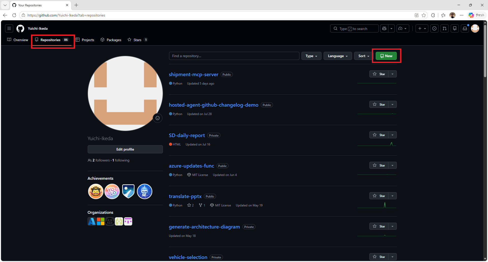

3. `Repository name` に `<your-name>-shipping-agent` と入力します。
4. 公開範囲などは講師の指示に従います。画像の例では Public リポジトリを使用しています。
5. ページの下にある `Create repository` を選択します。

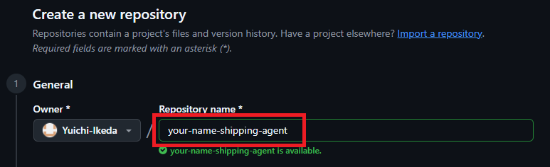

### 3.2 Codespace を作成する

1. 作成した空のリポジトリで `Create a codespace` を選択します。

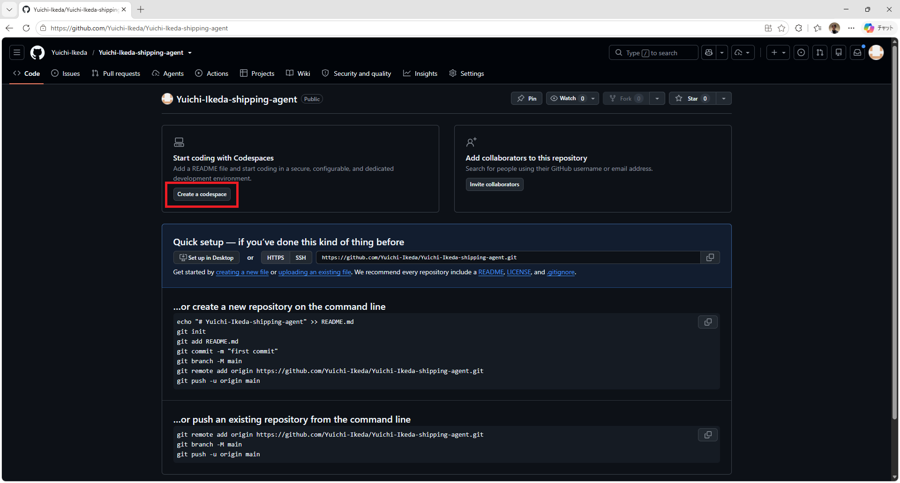

2. `Create new codespace` を選択します。
3. Codespace の作成が完了し、ブラウザー版 VS Code が表示されるまで待ちます。

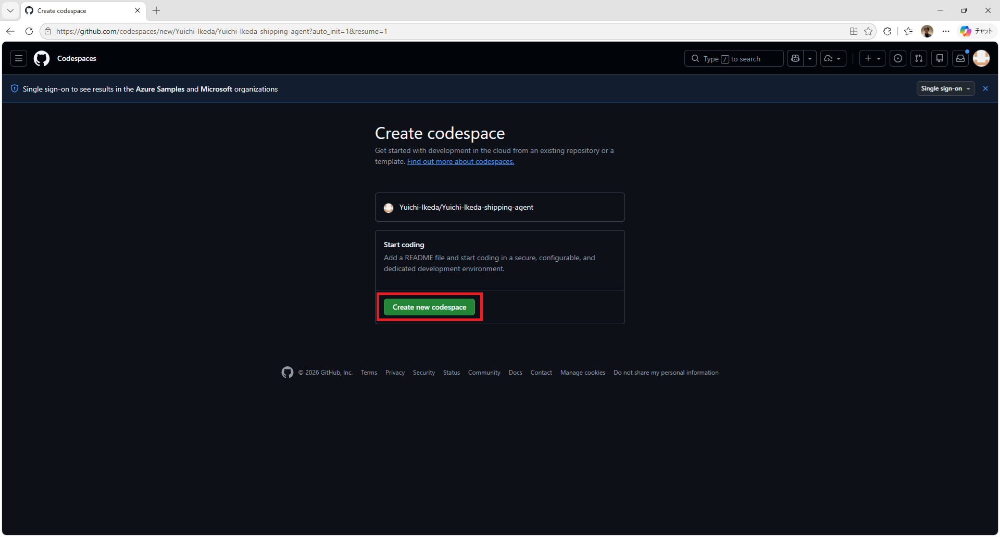

### 3.3 ワークスペースを信頼する

VS Code に「このフォルダー内のファイルの作成者を信頼しますか?」と表示されたら、リポジトリが自分で作成したものであることを確認し、`フォルダーを信頼して続行` を選択します。

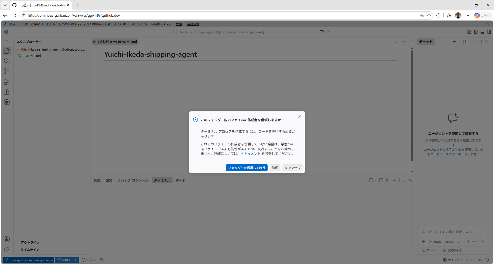

## 4. VS Code 拡張機能と Azure サインイン

### 4.1 Python 拡張機能をインストールする

1. アクティビティ バーの `拡張機能` を開きます。
2. `Python` を検索します。
3. 発行元が Microsoft の `Python` 拡張機能を選び、`インストール` を選択します。

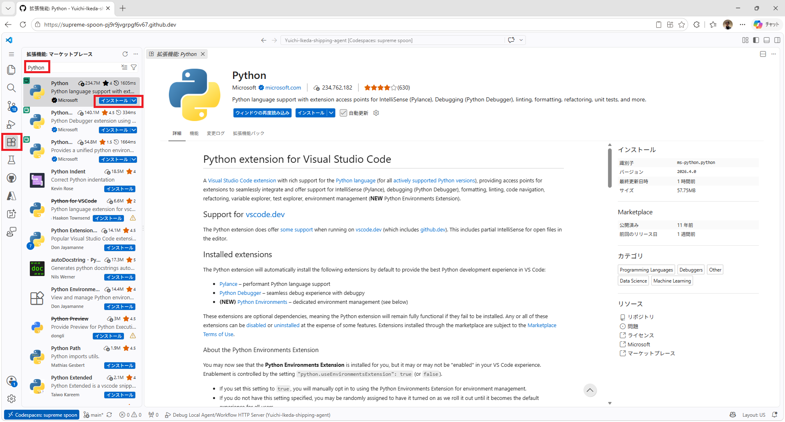

### 4.2 Foundry Toolkit をインストールする

1. 拡張機能ビューで `Foundry` を検索します。
2. 発行元が Microsoft の `Foundry Toolkit for VS Code` を選び、`インストール` を選択します。
3. 再読み込みを求められた場合は、VS Code のウィンドウを再読み込みします。

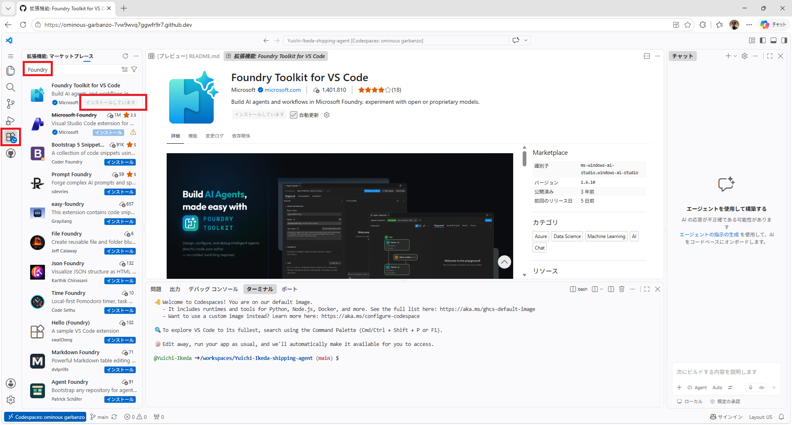

### 4.3 Azure にサインインする

1. アクティビティ バーの Azure アイコンを選択します。
2. `Resources` の `Sign in to Azure...` を選択します。
3. ブラウザーに表示される案内に従い、ハンズオンで使用する Azure アカウントでサインインします。

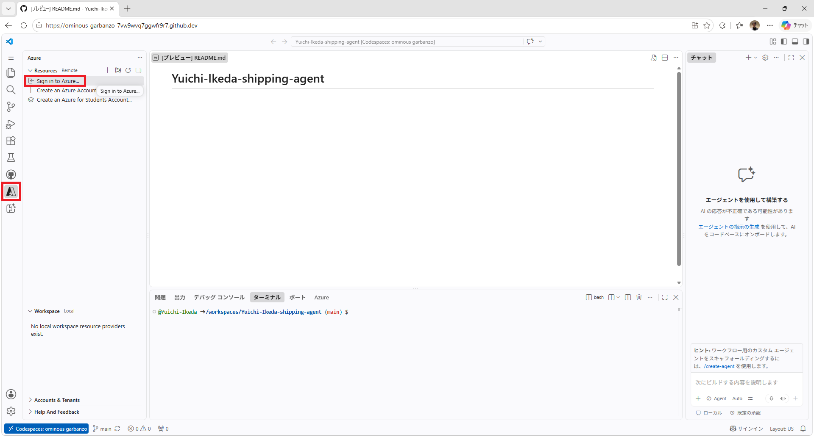

4. Azure ビューにサブスクリプションと `Microsoft Foundry` のリソースが表示されることを確認します。
5. 複数のテナントまたはサブスクリプションがある場合は、講師が指定したものが表示されていることを確認します。

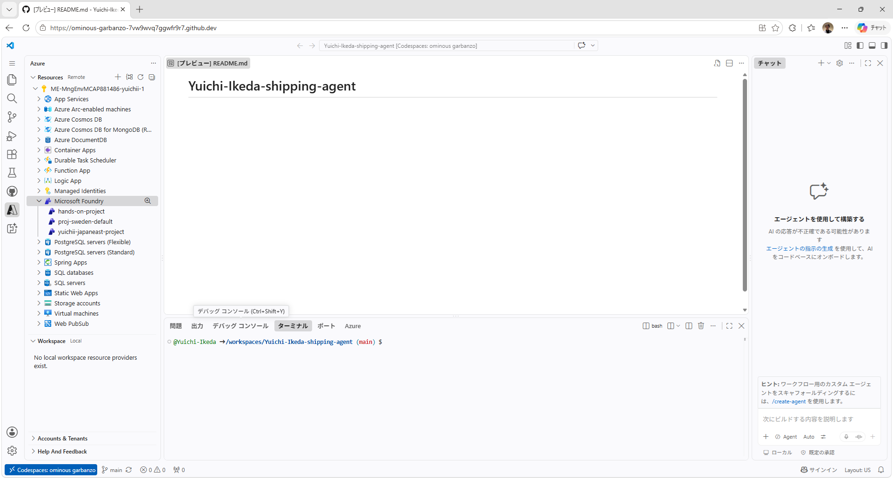

## 5. Microsoft Foundry プロジェクトとモデルの準備

### 5.1 Foundry プロジェクトを作成する

1. アクティビティ バーの Foundry Toolkit アイコンを選択します。
2. `My Resources` の `Set Foundry Project` を選択します。
3. コマンド パレットで `Create project` を選択します。

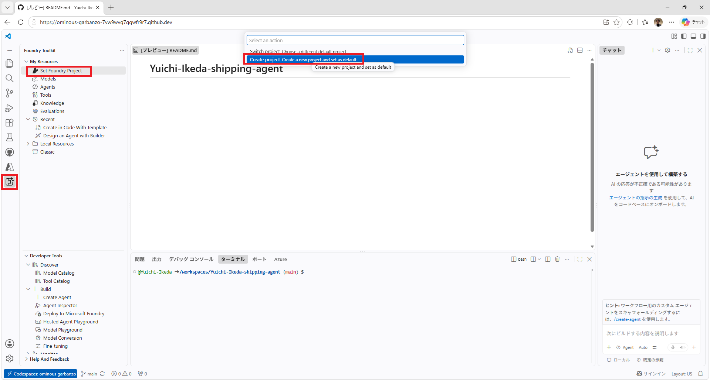

4. 使用するリソース グループを選択します。講師から指定されている場合は、そのリソース グループを選択してください。
5. 新しいリソース グループを作成する場合は `Create new resource group` を選び、画面の指示に従います。

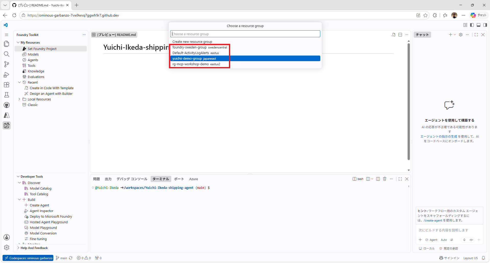

6. プロジェクト名に `<your-name>-project` と入力し、`Enter` を押します。

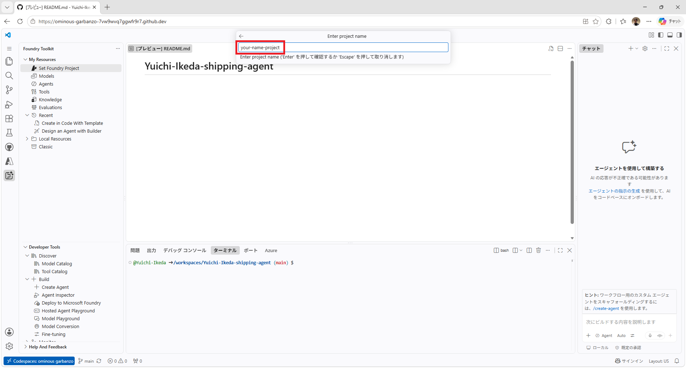

7. 作成処理が終わるまで待ちます。
8. `My Resources` の直下に作成したプロジェクト名が表示され、そのプロジェクトが選択中になっていることを確認します。

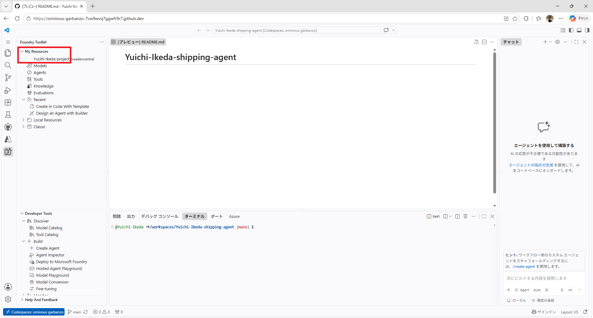

> [!NOTE]
> 画像のプロジェクトは Sweden Central に作成されています。利用可能なリージョンはサブスクリプション、モデル、Hosted Agent の提供状況によって異なります。ハンズオンでは講師が指定したリージョンを使用してください。

### 5.2 モデルをデプロイする

1. Foundry Toolkit の `Models` を選択します。
2. `Add model` を選択します。

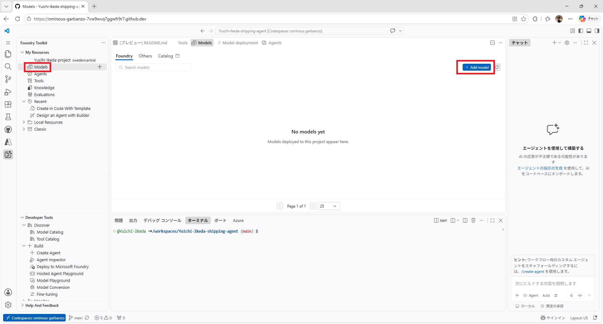

3. `Deploy model` で `gpt-5.6-luna` を選択します。
4. `Deployment name` が `gpt-5.6-luna` であることを確認します。
5. `Deployment type` は画像の例と同じ `Global Standard` を選択します。選択肢にない場合は、別の種類を選ばず講師に確認してください。
6. `Deploy to Microsoft Foundry` を選択し、デプロイ完了まで待ちます。

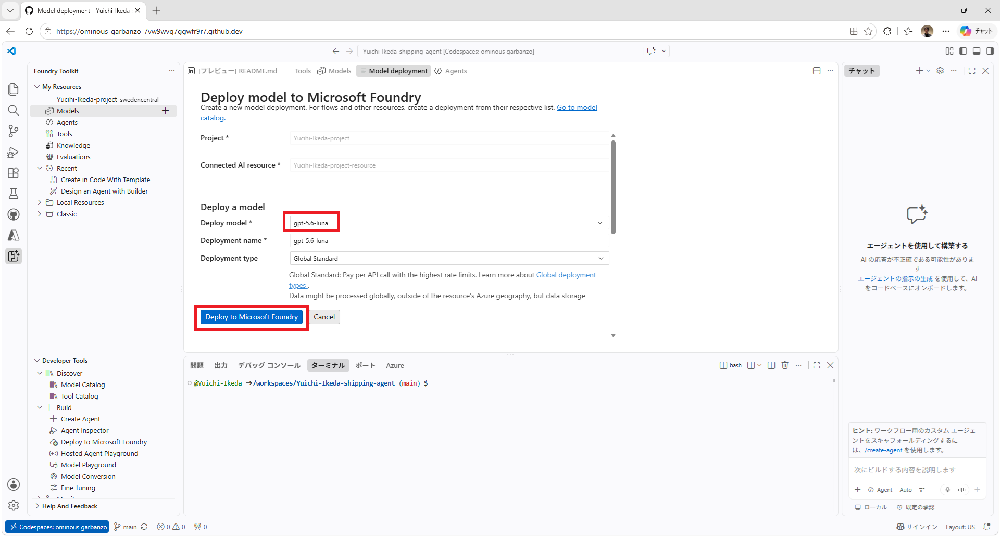

> [!WARNING]
> `gpt-5.6-luna` が一覧にない場合は、勝手に別のモデルを選ばず講師に確認してください。代替モデルを使用する場合は、モデルのデプロイ名、後述の Copilot プロンプト、生成された `azure.yaml` のモデル名をすべて同じ値にします。

## 6. 配送情報 MCP ツールと Toolbox の準備

### 6.1 リモート MCP サーバーを接続する

1. Foundry Toolkit の `Tools` を選択します。
2. 画面内の `Tools` タブを選択します。
3. `Connect Tool` を選択します。

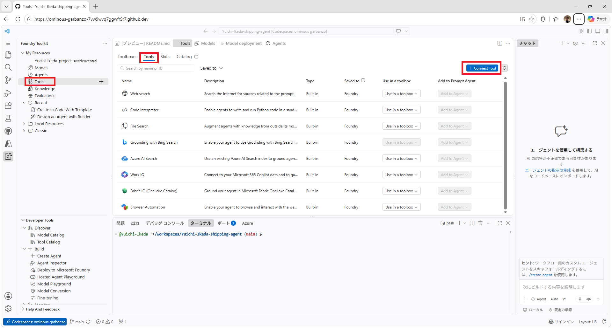

4. `Custom` タブを選択します。
5. `Model Context Protocol (MCP)` を選択します。
6. `Create` を選択します。

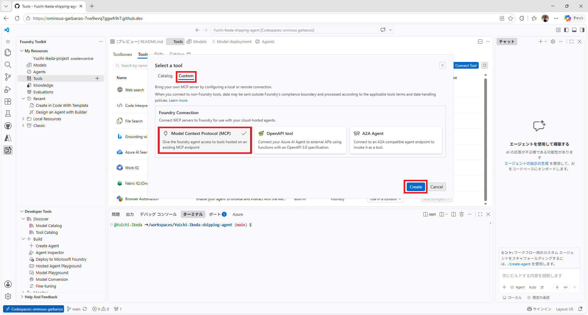

7. 次の値を入力します。

| 設定 | 入力値 |
|---|---|
| `Connection Name` | `shipment-mcp` |
| `Remote MCP Server Endpoint` | 講師から配布された MCP エンドポイント |
| `Authentication` | `Key Based` |
| 資格情報の名前 | `x-functions-key` |
| 資格情報の値 | 講師から配布された Function Key |

講師から配布されたエンドポイントをそのまま入力してください。画像の Azure Functions MCP エンドポイントは、次の形式です。

```text
https://<function-app-name>.azurewebsites.net/runtime/webhooks/mcp
```

8. 入力内容を確認し、`Connect` を選択します。

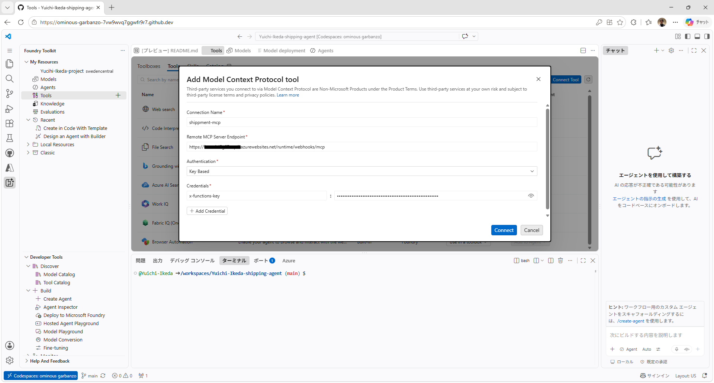

9. Tools の一覧に `shipment-mcp` が表示されることを確認します。

### 6.2 Toolbox を作成する

1. `shipment-mcp` 行の `Use in a toolbox` を開きます。
2. `Create a new toolbox` を選択します。

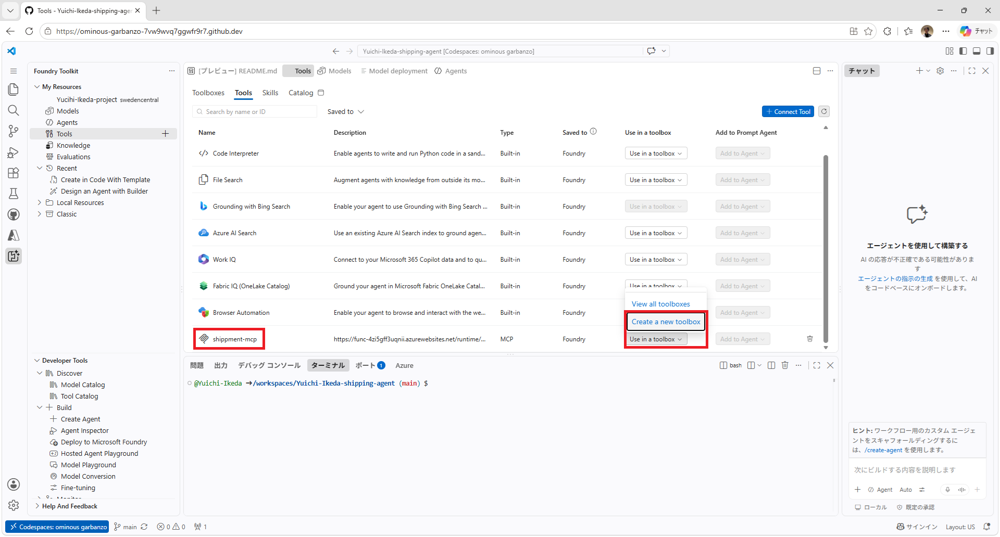

3. `Name` に `delivery-management-toolbox` と入力します。
4. 右側の `INCLUDED` に `shipment-mcp` が含まれていることを確認します。
5. このハンズオンではツールが 1 つだけなので、`Tool search` はオフのままにします。
6. このハンズオンでは `Guardrail` を `None` のままにします。本番環境では組織の要件に合うガードレールを設定してください。
7. `Publish` を選択します。

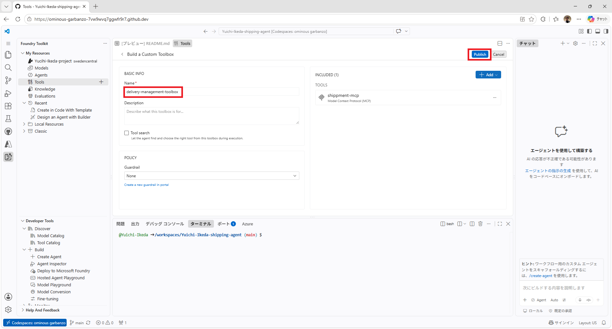

8. `Toolboxes` タブに `delivery-management-toolbox` が表示されることを確認します。

## 7. GitHub Copilot で Hosted Agent を作成する

### 7.1 Foundry Toolkit のエージェント作成画面を開く

1. Foundry Toolkit の `Developer Tools`、`Build` を展開します。
2. `Create Agent` を選択します。
3. `Code an agent with Copilot` を選択します。

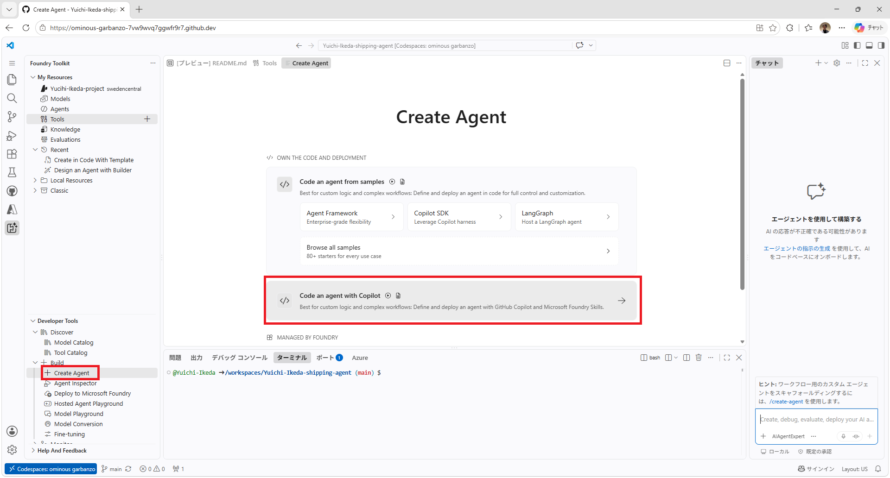

4. GitHub Copilot へのサインインを求められた場合は、`GitHub で続行する` を選択し、Codespaces と同じ GitHub アカウントで認証します。

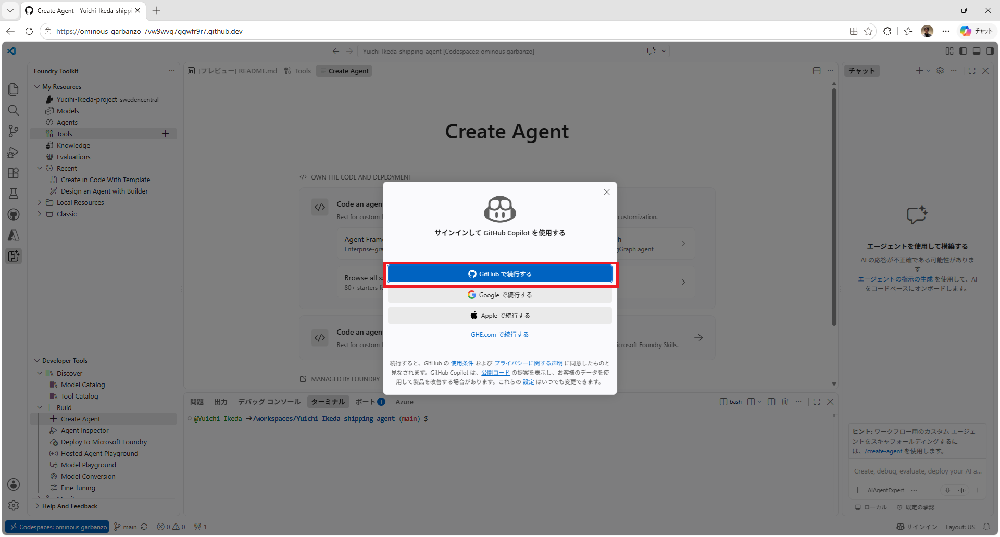

### 7.2 作成プロンプトを送信する

1. チャットの設定が、以下になっていることを確認します。

| モード | モデル | 推論の深さ |
|---|---|---|
| `AIAgentExpert` | `GPT-5.6 Sol` | `Medium 272K` |

| 承認レベル | 
|---|
| `承認のバイパス (Allow all)` |

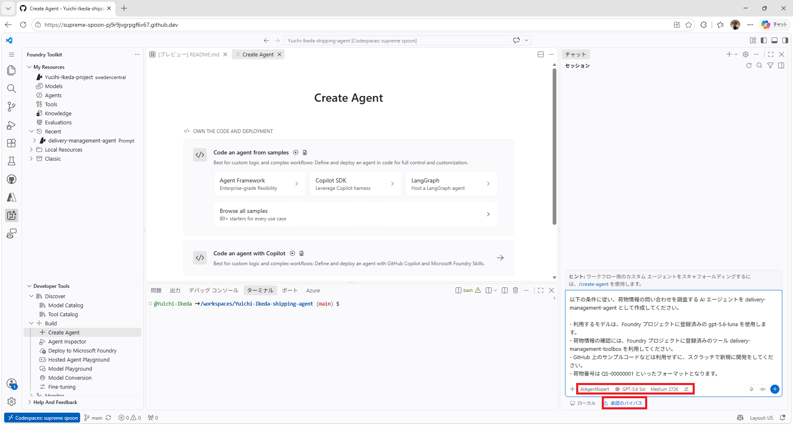

2. 次のプロンプトを貼り付けて送信します。

```text
以下の条件に従い、荷物情報の問い合わせを調査する AI エージェントを delivery-management-agent として作成してください。

- 利用するモデルは、Foundry プロジェクトに登録済みの gpt-5.6-luna を使用します。
- 荷物情報の確認には、Foundry プロジェクトに登録済みのツール delivery-management-toolbox を利用してください。
- GitHub 上のサンプルコードなどは利用せずに、スクラッチで新規に開発をしてください。
- 荷物番号は QS-00000001 といったフォーマットとなります。
```

> [!CAUTION]
> 画像では `承認のバイパス` が有効になっています。有効にすると、Copilot がファイル変更、パッケージ導入、`az` や `azd` などのターミナル コマンドを個別承認なしで実行します。実行中の表示と完了後の変更一覧を確認してください。組織のポリシーで禁止されている場合や共有環境では、有効にせず操作ごとに内容を確認して承認される事を推奨します。

### 7.3 Copilot が要求するセットアップを完了する

Copilot は環境を確認しながら作業します。すでに導入・認証済みの項目は表示されないことがあります。表示内容に応じ、次の操作を行います。

1. Azure 向けスキルのインストールを求められたら `Install` を選択します。

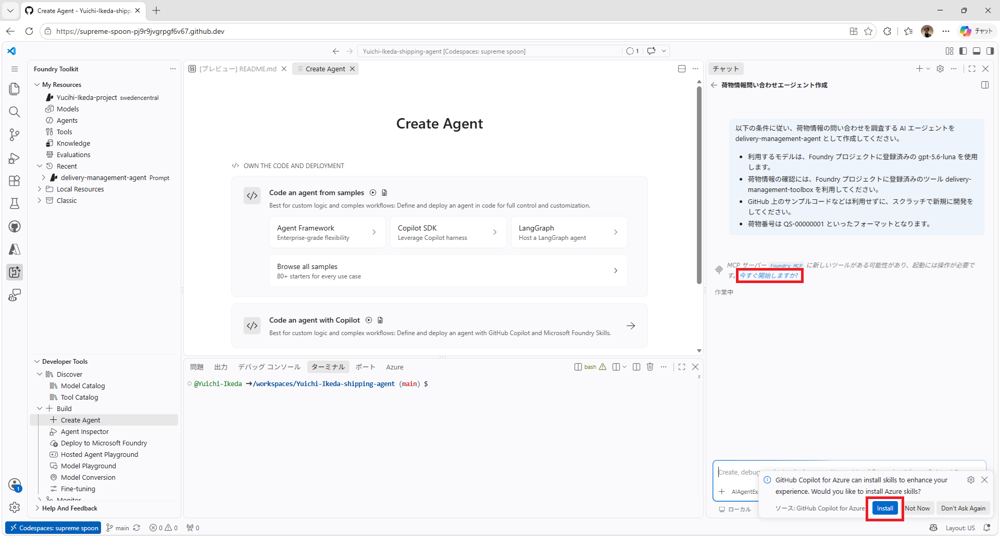

2. `今すぐ Foundry MCP を開始する` をクリックし、認証ダイアログが表示されたら、`許可` を選択します。

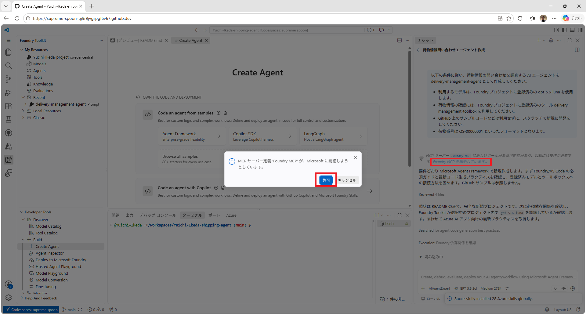

3. 「Foundry Toolkit で選択中のプロジェクトを再利用しますか?」と質問されたら、作成したプロジェクト名とモデル、Toolbox が正しいことを確認し、`再利用する（推奨）` を選択して送信します。

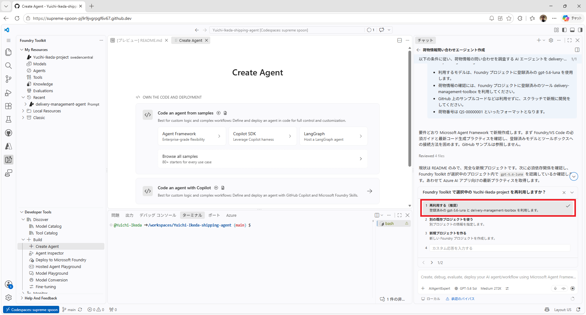

4. Azure Developer CLI (`azd`) のインストール確認が表示された場合は、`インストールする（推奨）` を選択して送信します。

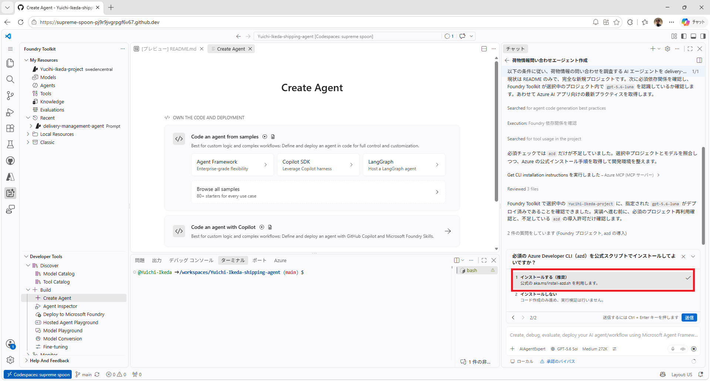

5. Azure CLI (`az`) のインストール確認が表示された場合は、`インストールする（推奨）` を選択して送信します。

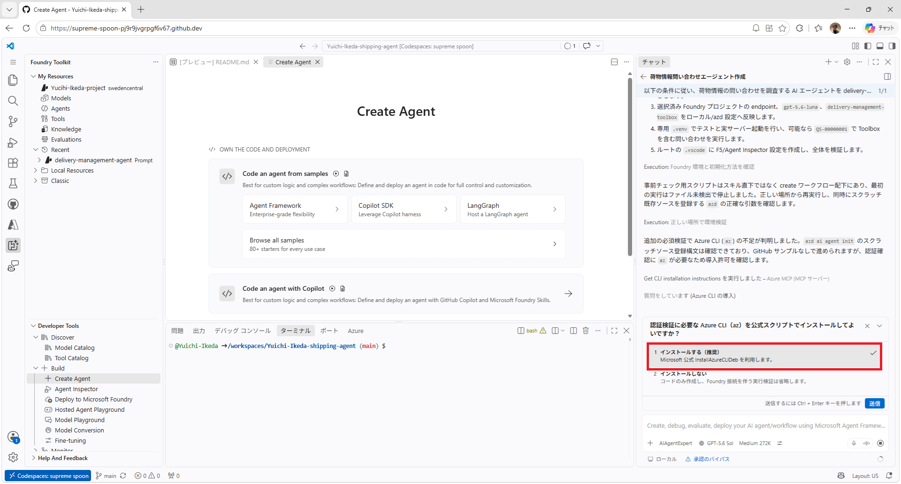

### 7.4 Azure CLI と Azure Developer CLI を認証する

VS Code 拡張機能へのサインインとは別に、ターミナルで使用する Azure CLI と Azure Developer CLI の認証が必要です。Copilot が認証待ちになったら、ターミナルで次のコマンドを 1 つずつ実行します。

```bash
az login
azd auth login
```

1. ブラウザーまたはデバイス コードの案内に従って認証します。
2. `az login` で候補が表示された場合は、ハンズオン用のテナントとサブスクリプションを選択します。
3. 両方のログインが完了し、Copilot が認証待ちで一時停止していたら、同じチャットの入力欄に `認証完了` と入力して送信します。Copilot が残りの生成と検証を再開します。

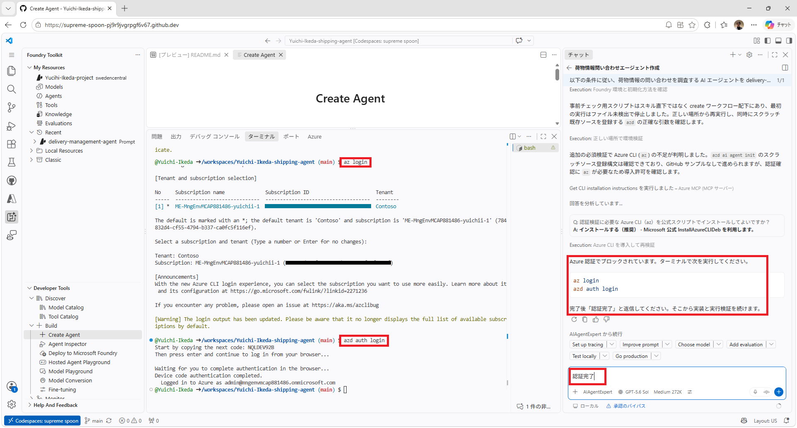

> [!IMPORTANT]
> Azure 拡張機能、`az`、`azd` が異なるアカウントやサブスクリプションを参照すると、モデルや Toolbox が見つからないことがあります。3 つすべてで同じハンズオン環境を使用してください。

### 7.5 生成結果を確認する

1. Copilot がソース コードの生成、依存関係の設定、テスト、ローカル実行確認を終えるまで待ちます。
2. Copilot の完了メッセージで、少なくとも次の内容を確認します。

- `delivery-management-agent` が作成された
- `gpt-5.6-luna` を使用している
- `delivery-management-toolbox` に接続している
- `QS-` で始まる 8 桁の荷物番号を検証している
- Hosted Agent と F5 デバッグに対応している
- テストが成功している

3. 変更されたファイルを確認します。生成内容により多少異なりますが、`README.md`、エージェント実装、`main.py`、`azure.yaml`、`requirements.txt`、`.vscode/launch.json`、`.vscode/tasks.json` などが作成されます。
4. 変更一覧またはソース管理ビューで、MCP の Function Key がどのファイルにも含まれていないことを確認します。
5. `.env` などのローカル設定ファイルが生成された場合は、秘密値がないことと `.gitignore` の対象になっていることを確認します。
6. Copilot の変更内容を確認し、問題がなければ `保持` を選択します。

## 8. Agent Inspector でローカル デバッグする

### 8.1 Agent Inspector を起動する

1. アクティビティ バーの `実行とデバッグ` を開き、`Debug Local Agent/Workflow HTTP Server` を選択して再生ボタンを押します。

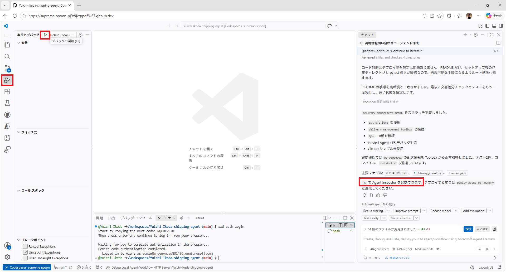

2. Agent Inspector が開き、次を確認します。

- 接続状態が `Connected`
- 接続先が `http://localhost:8088`
- プロトコルが `Responses Protocol`

### 8.2 配送状況を確認する

Agent Inspector の入力欄へ次のメッセージを送信します。

```text
QS-00000001 の配送状況を教えてください。
```

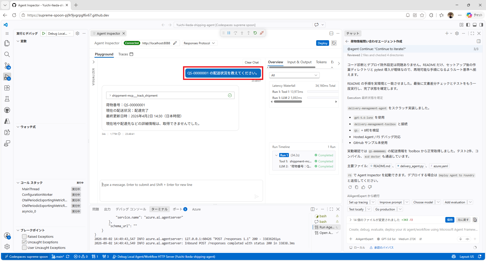

次を確認します。

- `shipment-mcp__track_shipment` の呼び出しに成功している
- 荷物番号が `QS-00000001` になっている
- 配送状況と最終更新日時が返る
- `Run Timeline` が `Completed` になる

## 9. Hosted Agent を Microsoft Foundry にデプロイする

### 9.1 デプロイ ウィザードを開く

1. ローカル テストが成功したことを確認します。
2. Agent Inspector 右上の `Deploy` を選択します。

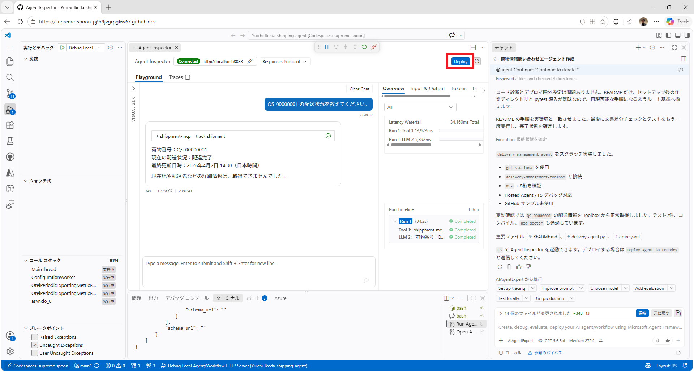

### 9.2 デプロイ方法を選択する

`Deploy Hosted Agent` の `Basics` で次の値を選択します。

| 設定 | 選択値 |
|---|---|
| `Deployment Method` | `Code` |
| `Package Mode` | `Remote` |
| `Deploy to` | 画面に対象があれば `Existing agent`、なければ `New agent` |
| `Hosted Agent` | Existing の場合は `delivery-management-agent Current` |

Copilot の生成処理で Hosted Agent の定義が先に作られていると、画像のように `Existing agent` に表示されます。表示されない初回デプロイでは `New agent` を選択し、エージェント名に `delivery-management-agent` を指定します。

設定後、`Next` を選択します。

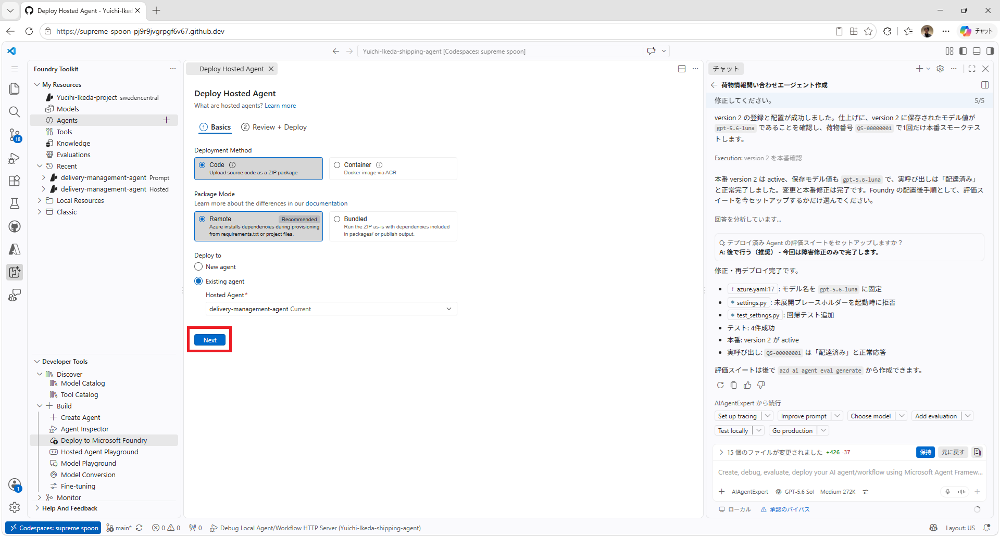

### 9.3 ランタイム設定を確認してデプロイする

`Review + Deploy` で次の値を確認します。

| 設定 | 値 |
|---|---|
| `Language` | `Python (Auto-detected)` |
| `Runtime Version` | `Python 3.14` |
| `Entry Point` | `python main.py` |
| `CPU and Memory` | `0.5 CPU / 1.0 Gi` |

画像と異なる値が自動検出された場合は、生成された `azure.yaml` と `main.py` に一致する値を優先してください。内容を確認し、`Deploy` を選択します。

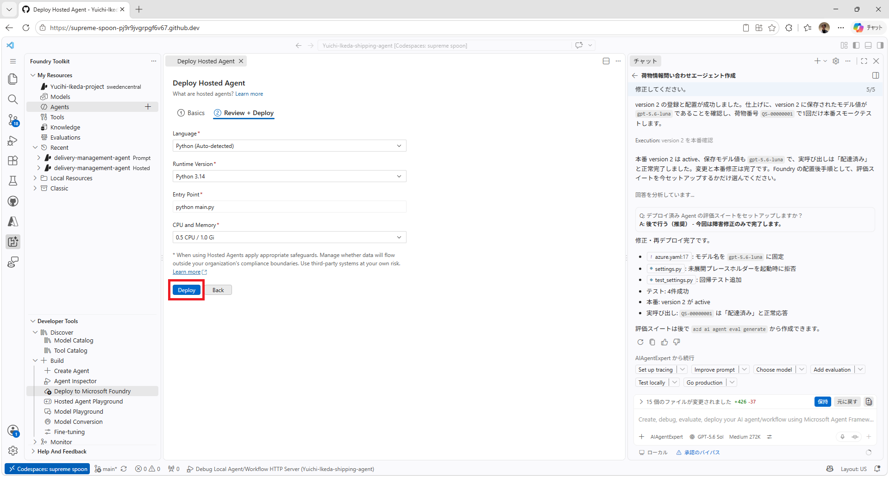

### 9.4 デプロイ完了を確認する

1. Foundry Toolkit の `出力` を開きます。
2. ZIP パッケージのアップロードと Hosted Agent バージョンの作成が完了するまで待ちます。
3. 出力に `Hosted agent deployment process completed successfully` と表示されることを確認します。

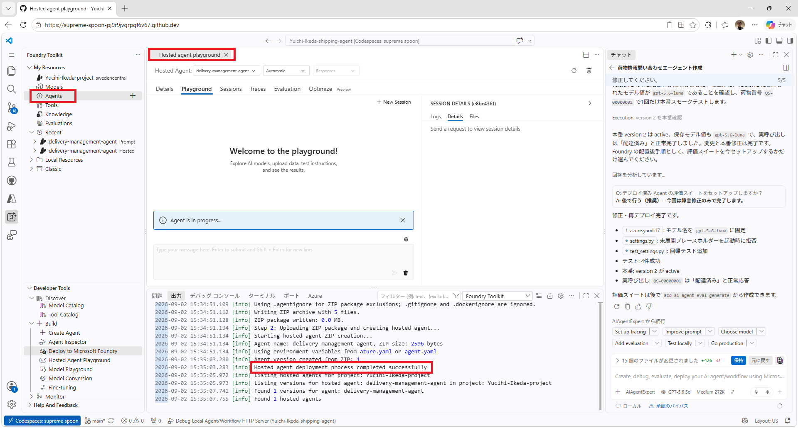

> [!NOTE]
> デプロイ直後は Playground に `Agent is in progress...` と表示されることがあります。まず 15～30 秒待ってから再試行してください。2 分以上続く場合は、出力ログと「12. トラブルシューティング」を確認します。

### 9.5 Hosted Agent Playground でテストする

Hosted Agent Playground で、ローカル テストと同じメッセージを送信します。

```text
QS-00000001 の配送状況を教えてください。
```

次を確認します。

- セッションの状態が `Active`
- `shipment-mcp__track_shipment` の呼び出しが成功している
- 配送状況が返る

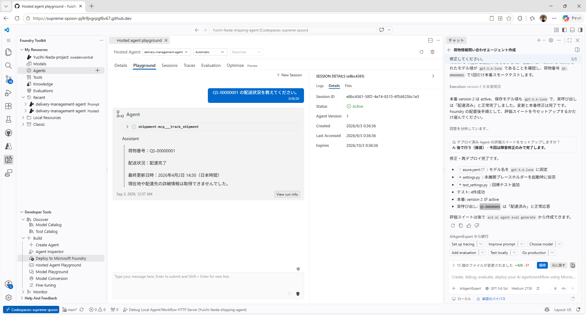

## 10. Microsoft Foundry ポータルで確認する

### 10.1 Hosted Agent の状態を確認する

1. [Microsoft Foundry ポータル](https://ai.azure.com/) を開きます。
2. このハンズオンで作成した Foundry プロジェクトを選択します。
3. `ビルド` の `エージェント` を開きます。
4. `delivery-management-agent` が一覧に表示され、次の状態になっていることを確認します。

- 状態: `実行中`
- 種類: `ホスト`
- バージョン: 1 以上

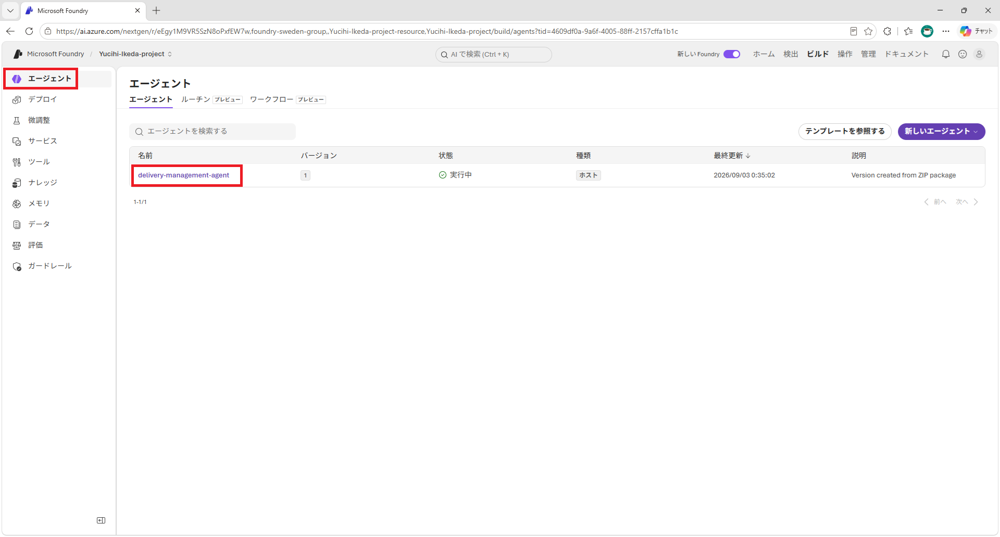

### 10.2 Web アプリのプレビューを開く

1. `delivery-management-agent` を選択します。
2. 画面右上の `発行する` を開きます。
3. `Web アプリのプレビュー` を選択します。

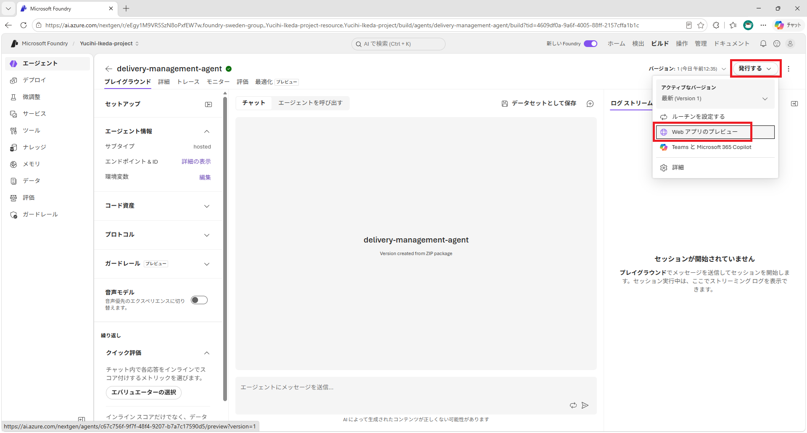

### 10.3 複数ターンの会話を確認する

Web アプリのプレビューで、次のメッセージを順番に送信します。

```text
QS-00000002 の配送状況を教えてください。
```

```text
詳細情報を教えて
```

1 回目の応答で配送状況が返り、2 回目の応答で同じ荷物番号の詳細情報が返ることを確認します。これにより、MCP ツールの呼び出しと会話コンテキストの維持を確認できます。

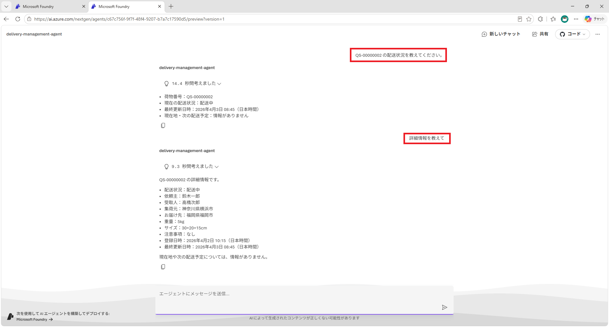

## 11. 完了条件

次のすべてを満たせば、ハンズオンは完了です。

- [ ] Foundry Toolkit で自分の Foundry プロジェクトが選択されている
- [ ] `gpt-5.6-luna` のモデル デプロイが存在する
- [ ] `shipment-mcp` 接続が存在する
- [ ] `delivery-management-toolbox` が公開されている
- [ ] `delivery-management-agent` のコードがリポジトリに生成されている
- [ ] Agent Inspector で MCP ツールの呼び出しに成功する
- [ ] Hosted Agent のデプロイが成功する
- [ ] Foundry ポータルで Hosted Agent が実行中になっている
- [ ] Web アプリのプレビューで複数ターンの問い合わせに応答できる

## 12. トラブルシューティング

### Foundry プロジェクト、モデル、Toolbox が見つからない

- Foundry Toolkit で正しいプロジェクトが選択されているか確認します。
- Azure 拡張機能、`az`、`azd` が同じテナントとサブスクリプションを使用しているか確認します。
- モデル デプロイ名が `gpt-5.6-luna` と完全に一致しているか確認します。
- Toolbox 名が `delivery-management-toolbox` と完全に一致し、`Publish` 済みであることを確認します。

### Copilot が認証待ちのまま進まない

- `az login` と `azd auth login` の両方が完了しているか確認します。
- 認証後、Copilot が待機している同じチャットに `認証完了` と送信します。
- Codespaces の再接続後など、認証セッションが切れた場合は、表示された案内に従って再認証します。

### MCP ツールの呼び出しに失敗する

- `shipment-mcp` のエンドポイント末尾が `/runtime/webhooks/mcp` になっているか確認します。
- 認証方式が `Key Based`、資格情報名が `x-functions-key` になっているか確認します。
- Function Key の期限切れや貼り付け間違いがないか講師に確認します。
- `shipment-mcp` が `delivery-management-toolbox` の `INCLUDED` に含まれているか確認します。
- Toolbox が存在しない場合、MCP の初期接続後に `Session terminated` や 404 と表示されることがあります。Toolbox の作成と公開をやり直してください。

### `F5` を押しても Agent Inspector が開かない

- Microsoft の Python 拡張機能がインストール済みか確認します。
- `.vscode/launch.json` と `.vscode/tasks.json` がリポジトリのルートにあるか確認します。
- `実行とデバッグ` から `Debug Local Agent/Workflow HTTP Server` を明示的に選択します。
- `ターミナル` と `出力` に表示された最初のエラーを確認します。

### デプロイ後も Agent が起動しない

- デプロイ直後のコールド スタートでは時間がかかる場合があります。少し待ってから再試行します。
- Foundry Toolkit の `出力` でデプロイ成功メッセージを確認します。
- Entry Point が `python main.py` で、`main.py` がデプロイ対象のルートに存在するか確認します。
- モデル デプロイ名と Toolbox 名が生成された設定に正しく反映されているか確認します。

### 荷物番号が拒否される

荷物番号は `QS-` に続く 8 桁の数字です。例: `QS-00000001`。全角文字、桁数不足、余分な空白がないか確認してください。

## 13. 後片付け

ハンズオン終了後は講師の指示に従い、自分で作成したリソースだけを削除します。共有リソース グループを使用している場合は、リソース グループ全体を削除しないでください。

削除対象の例:

1. `delivery-management-agent` の不要なバージョンまたは Agent 本体
2. `delivery-management-toolbox`
3. `shipment-mcp` 接続
4. `gpt-5.6-luna` のモデル デプロイ
5. 自分で新規作成した Foundry プロジェクトと、そのためだけに作成したリソース グループ
6. 不要になった GitHub Codespace

> [!WARNING]
> リソース グループの削除は、その中の全リソースを削除します。講師またはほかの参加者と共有していないことを確認してから実行してください。

## 14. 参考リンク

- [Microsoft Foundry](https://ai.azure.com/)
- [Microsoft Foundry のドキュメント](https://learn.microsoft.com/azure/foundry/)
- [Foundry Hosted Agents の概要](https://learn.microsoft.com/azure/foundry/agents/concepts/hosted-agents)
- [Foundry Agent Service の料金](https://azure.microsoft.com/pricing/details/foundry-agent-service/)
- [Azure Developer CLI のインストール](https://learn.microsoft.com/azure/developer/azure-developer-cli/install-azd)
- [Azure CLI のインストール](https://learn.microsoft.com/cli/azure/install-azure-cli)
- [GitHub Codespaces のドキュメント](https://docs.github.com/codespaces)